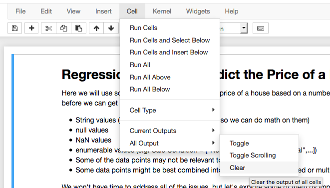

# Contributing

> We welcome pull-requests!

Since this is an interactive class, we want the course to be clean and ready for a new student to walk through it. To achieve this goal, please check the following before submitting a pull-request:

1. All code outputs are cleared: `Cell > All Output > Clear`

2. Delete any empty or experimental code blocks that were temporarily created to explore the data
